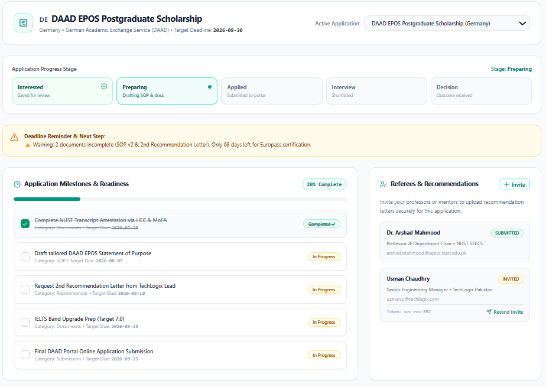
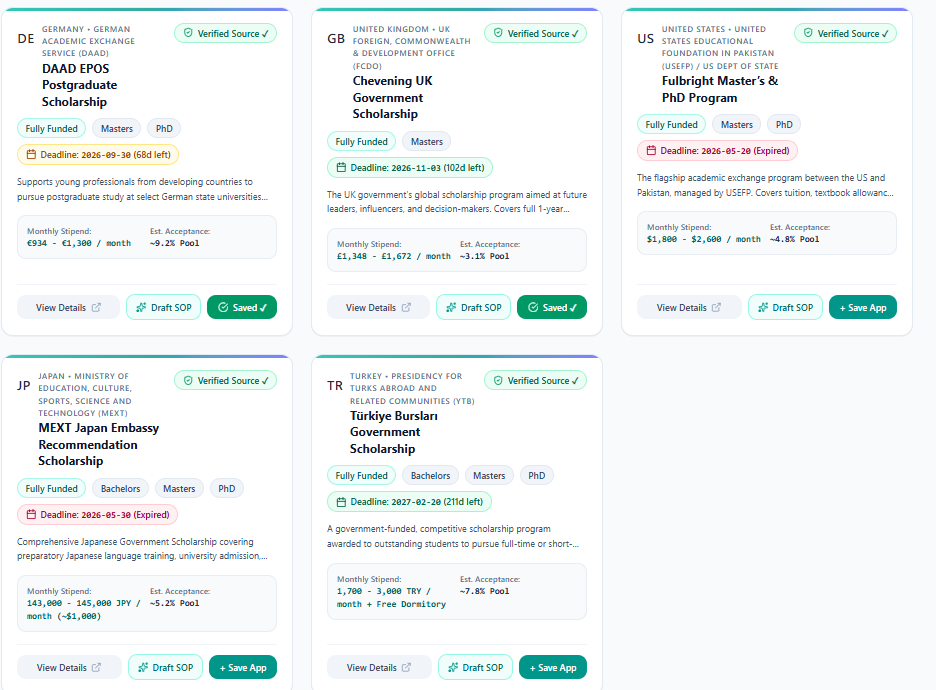
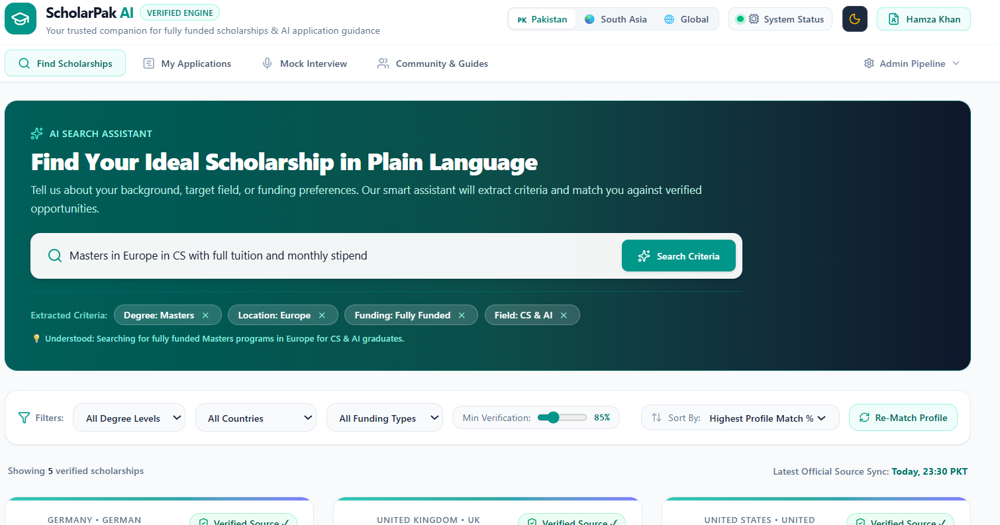

# 🎓 ScholarPak AI

> An AI-powered global scholarship platform that helps students discover scholarships, check eligibility, receive personalized AI recommendations, and manage their scholarship journey from one place.


---

## 🌐 Live Demo

https://scholarpak-kn4nvhl5t-atifullah1.vercel.app/

# ✨ Features

- 🔍 Smart Scholarship Search
- 🤖 AI-Powered Scholarship Recommendations
- 🎯 AI Match Score Calculator
- 📋 Detailed Scholarship Information
- 👤 User Profile Management
- 🌍 Country & Community Hub
- 💬 AI Mock Interview Module
- 📊 Operations Intelligence Dashboard
- 🕸️ Trust Graph
- 📱 Fully Responsive UI

---

# 🚀 Problem It Solves

Finding scholarships is difficult because information is scattered across many websites.

ScholarPak AI solves this by providing:

- A centralized scholarship platform
- Personalized AI recommendations
- Eligibility matching
- Organized scholarship information
- A modern and easy-to-use interface

---

# 🛠️ Tech Stack

## Frontend

- React
- TypeScript
- Vite
- CSS

## Backend

- Node.js

## AI

- Google Gemini AI

---

# 📂 Project Structure

```text
scholarpak/
│
├── src/
│   ├── screenshots/
│   │   ├── 3.png
│   │   ├── 22.png
│   │   └── aa.png
│   │
│   ├── components/
│   ├── data/
│   └── ...
│
├── assets/
├── package.json
├── README.md
└── ...
```

---

# 📸 Screenshots

## 🏠 Home Page



---

## 📊 Dashboard



---

## 🔍 Scholarship Search



---

# ⚙️ Installation

Clone the repository

```bash
git clone https://github.com/atifullah197-coder/scholarpak.git
```

Move into the project folder

```bash
cd scholarpak
```

Install dependencies

```bash
npm install
```

Run the development server

```bash
npm run dev
```

---

# 💡 Future Improvements

- 📧 Email Notifications
- 🔔 Scholarship Deadline Alerts
- ❤️ Save Favorite Scholarships
- 📄 AI SOP Generator
- 📑 AI Resume Analyzer
- 🌐 Multi-language Support
- 📱 Mobile Application

---

# 🤝 Contributing

Contributions are welcome.

1. Fork the repository
2. Create a feature branch

```bash
git checkout -b feature-name
```

3. Commit your changes

```bash
git commit -m "Added new feature"
```

4. Push to GitHub

```bash
git push origin feature-name
```

5. Create a Pull Request

---

# 📄 License

This project is licensed under the **MIT License**.

---

# 👨‍💻 Author

**Atifullah**

GitHub: https://github.com/atifullah197-coder

---

⭐ **If you found this project helpful, don't forget to give it a Star!**